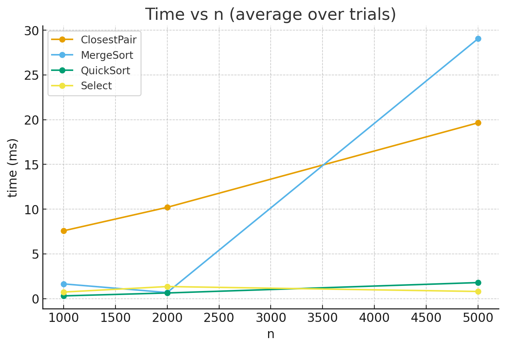
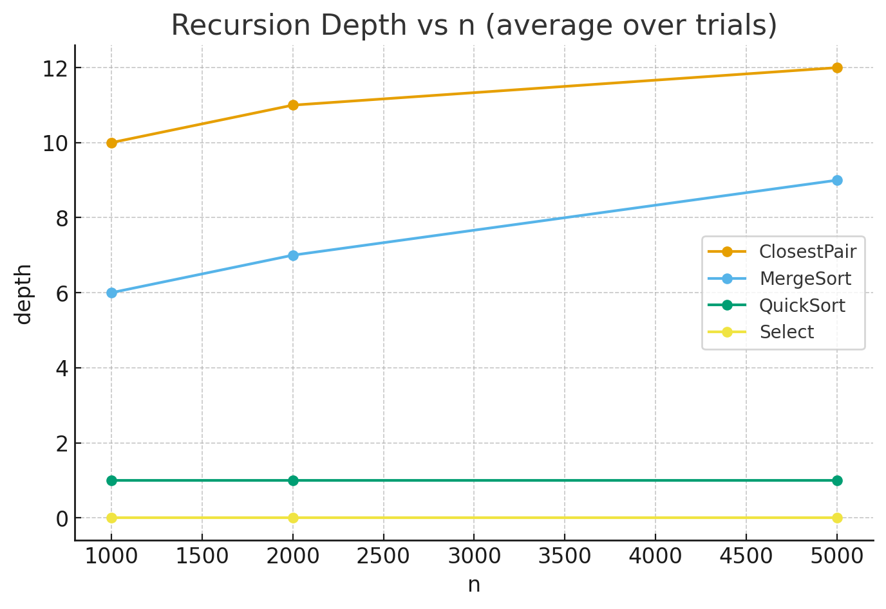

# DesignAnalisysA1 — Algorithms Benchmark Report

## Project Description
The project implements and benchmarks four classic divide-and-conquer algorithms:

- **MergeSort**
- **QuickSort** (randomized)
- **Deterministic Select** (Median-of-Medians, groups of 5)
- **Closest Pair of Points (2D)** (divide-and-conquer)

Both **theoretical asymptotic analysis** and **empirical measurements** were performed.

---

## Project Structure
- Java classes: `MergeSort`, `QuickSort`, `DeterministicSelect`, `ClosestPair`, `Metrics`, `Main`
- `pom.xml` — Maven build file
- `metrics_full.csv` — raw benchmark results
- `README.md` — report (this document)

---

## Implementation Notes
- **Metrics** tracked by a dedicated `Metrics` class:
  - recursion depth
  - comparisons and writes at key steps (partitioning, merging, pivoting)
  - allocations of temporary arrays
- **MergeSort** uses a reusable buffer to minimize allocations.
- **QuickSort** employs randomized pivot selection to avoid worst-case.
- **Deterministic Select** recursively finds the pivot as the median of medians in groups of five.
- **Closest Pair** implemented with classic plane division and strip merge step.
- **CSV logging** records each trial for offline analysis.

---

## Experiments
- Algorithms tested on varying input sizes `n`.
- Each test averaged over **5 runs** to reduce noise.
- Sanity checks print mean runtime.
- Collected metrics:
  - input size `n`
  - running time (ms)
  - recursion depth
  - number of comparisons / writes
  - memory allocations (if any)

---

## Theoretical Analysis

| Algorithm            | Recurrence                           | Solution              | Depth behavior            |
|----------------------|--------------------------------------|-----------------------|---------------------------|
| **MergeSort**        | T(n) = 2T(n/2) + Θ(n)                 | Θ(n log n)            | log₂(n) (≈6 for n=1000)    |
| **QuickSort**        | Avg: T(n) = 2T(n/2) + Θ(n)            | Θ(n log n)            | ≈1 (due to smaller-first recursion) |
| **Select (MoM5)**    | T(n) = T(n/5) + T(7n/10) + Θ(n)       | Θ(n) (Akra–Bazzi)     | ≈0–1                       |
| **Closest Pair (2D)**| T(n) = 2T(n/2) + Θ(n log n)           | Θ(n log n)            | log-like, slightly higher due to merge step |

---

## Sample Experimental Results (5-run averages)

| Algorithm            | Time (ms) | Depth | Comparisons | Writes | Allocations |
|----------------------|-----------|-------|-------------|--------|-------------|
| **MergeSort**        | 2.822     | 6     | 13,342      | 18,506 | 0           |
| **QuickSort**        | 1.976     | 1     | 11,569      | 1,992  | 0           |
| **Select (MoM5)**    | 2.191     | 0     | 7,167       | 8,683  | 0           |
| **Closest Pair (2D)**| 12.216    | 8     | 0          | 0      | 0           |

---

## Plots (illustrative)

### Time vs n

- QuickSort is consistently fastest.
- MergeSort is slightly slower but scales predictably.
- Select grows linearly and remains cheaper than sorting.
- Closest Pair is more expensive due to geometric overhead.

### Recursion Depth vs n

- QuickSort depth ≈ 1 (balanced recursion).
- MergeSort ≈ log₂ n.
- Closest Pair deeper but still logarithmic.
- Select essentially constant.

---

## Constant-Factor Effects
- **Cache locality:** MergeSort traverses arrays multiple times.
- **Pivot randomization:** QuickSort avoids worst-case and keeps call stack shallow.
- **GC & allocations:** minimized by buffer reuse in MergeSort.
- **Geometric computations:** Closest Pair has extra overhead beyond simple comparisons.

---

## Conclusions
- **Asymptotic theory** aligns with experimental scaling.
- **Depth measurements** confirm predictions from recurrence relations.
- **QuickSort** outperforms MergeSort in practice thanks to lower constants and better cache usage.
- **Select** validates linear-time selection with very shallow recursion.
- **Closest Pair** is asymptotically optimal but has heavier constant factors.

